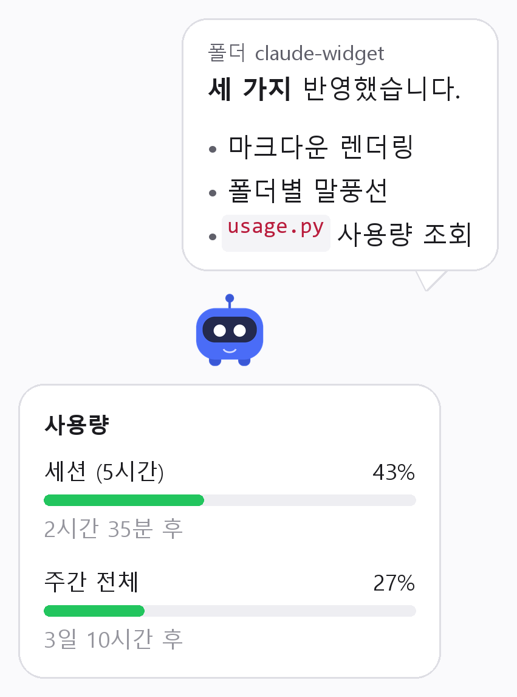

# 클로드 위젯 (Claude Widget)

> 한 줄 소개: 이 스킬은 **Claude Code에 일을 시켜놓고 딴 일을 할 때**, 지금 뭘 하고 있고 언제 끝났는지를 **화면 위 캐릭터가 대신 알려줍니다.**

---

## 1. 이 스킬이 뭔가요?

Claude Code에 작업을 시키면 터미널을 계속 쳐다보게 됩니다. 다 끝났는지, 권한 승인을 기다리는 중인지 확인하려고 창을 왔다 갔다 하게 되죠. 이 위젯은 그 확인을 대신해 줍니다. 화면 한쪽에 작은 캐릭터가 떠 있다가, Claude가 무언가를 실행하거나 답변을 마치면 말풍선으로 알려줍니다.

원래 이런 도구는 맥에만 있었습니다(Masko Code, Clabotch 등). 윈도우에서 쓰려고 직접 만들었습니다.

- **상태 알림**: 도구 실행 중, 입력 대기 중, 답변 완료를 말풍선으로 표시
- **여러 프로젝트 동시 확인**: 폴더를 여러 개 띄워놨으면 폴더마다 말풍선이 따로 생김
- **사용량 확인**: 캐릭터를 클릭하면 5시간 세션과 주간 사용량이 막대로 표시

캐릭터 이미지는 원하는 걸로 바꿀 수 있습니다. 움직이는 GIF도 됩니다.

## 2. 언제 쓰면 좋나요?

이런 상황에서 쓰면 딱이에요:

- **오래 걸리는 작업을 시켜놓고 다른 창에서 일할 때**. 끝나면 말풍선이 알려주니 터미널을 안 봐도 됩니다
- **권한 승인 대기로 멈춰 있는 걸 뒤늦게 발견할 때**. 승인 대기 상태가 바로 보입니다
- **프로젝트 여러 개를 동시에 돌릴 때**. 어느 폴더에서 뭐가 끝났는지 말풍선 머리에 폴더명이 붙습니다
- **사용량이 얼마나 남았는지 궁금할 때**. 캐릭터만 클릭하면 됩니다

설치하고 나면 따로 명령할 게 없습니다. Claude Code를 쓰는 동안 알아서 뜹니다.

## 3. 뭐가 좋아지나요? (Before → After)

| 구분 | 기존 방식 | 이 위젯을 쓰면 |
| --- | --- | --- |
| 작업 끝났는지 확인 | 터미널 창으로 전환해서 직접 확인 | 캐릭터 말풍선으로 바로 보임 |
| 승인 대기 발견 | 한참 뒤에야 멈춰 있던 걸 알아챔 | 멈춘 즉시 말풍선으로 표시 |
| 여러 프로젝트 동시 작업 | 창을 하나씩 열어보며 확인 | 폴더별 말풍선이 한 화면에 쌓임 |
| 사용량 확인 | 웹으로 들어가서 확인 | 캐릭터 클릭 한 번 |

한 줄 요약: **터미널을 쳐다보고 있지 않아도 됩니다.**

## 4. 사용 예시

**입력한 것**

> (평소처럼) Claude Code에 작업을 요청합니다. 위젯에 따로 명령할 필요는 없습니다.

**나온 결과**

> 작업 중에는 `실행중: Bash` 같은 말풍선이 뜨고, 답변이 끝나면 답변 요약이 말풍선으로 8초간 표시됩니다. 말풍선 위에는 어느 프로젝트인지 폴더명이 붙습니다. 캐릭터를 클릭하면 아래로 사용량 패널이 펴집니다.



## 5. 설치 방법

> 개발 지식이 없어도 됩니다. Claude Code가 알아서 설치합니다.

1. **파이썬이 있는지 확인합니다.** 시작 메뉴에서 `cmd`를 열고 `python --version`을 입력해 보세요.
   버전 숫자가 나오면 통과입니다. 아무것도 안 나오면 [python.org](https://www.python.org/downloads/)에서 설치하세요.
   설치할 때 첫 화면의 **Add python.exe to PATH** 를 반드시 체크해야 합니다.
2. **압축 파일을 받아 원하는 위치에 풉니다.** (예: `C:\Users\내이름\claude-widget`)
   나중에 이 폴더를 옮기면 연결이 끊어지니, 옮기지 않을 자리에 두세요.
3. **VS Code에서 그 폴더를 엽니다.** (파일 → 폴더 열기)
4. **Claude Code를 열고 이렇게 말합니다.**

   ```
   INSTALL.md 대로 설치해줘
   ```

   나머지는 Claude가 알아서 합니다. 필요한 라이브러리를 깔고, 설정 파일에 연결하고, 잘 되는지 검사까지 합니다.
5. **Claude Code를 껐다 켭니다.** 그다음 아무 작업이나 시켜보세요.
   **화면에 캐릭터가 나타나면 성공입니다.**

소요 시간: 약 3분 (파이썬이 이미 있으면 1분)

## 6. 주의사항 / 안 되는 것

- **윈도우 전용입니다.** 맥에서는 동작하지 않습니다. 맥은 Masko Code나 Clabotch를 쓰시면 됩니다.
- **설치 후 폴더를 옮기지 마세요.** 설정에 경로가 저장되므로, 옮기면 연결이 끊어집니다.
  옮겨야 한다면 Claude에게 "위젯 폴더를 여기로 옮기고 설정도 고쳐줘"라고 하세요. 순서가 중요합니다.
- **캐릭터 이미지를 바꿀 때**는 배경이 투명한 PNG나 GIF를 쓰세요. 배경이 있는 JPG를 넣으면 흰 네모가 같이 뜹니다.
- **사용량 표시는 참고용입니다.** 공식 API가 아니라 Claude Code가 쓰는 내부 주소를 조회하는 방식이라, 나중에 형식이 바뀌면 이 부분이 먼저 안 나올 수 있습니다. 말풍선 기능은 영향받지 않습니다.
- **로그인 정보는 밖으로 나가지 않습니다.** 사용량을 조회할 때만 PC에 저장된 토큰을 읽고, 어디에도 저장하거나 기록하지 않습니다.
- **캐릭터가 안 보이면** 다른 창에 가려졌거나 화면 밖으로 나갔을 수 있습니다. Claude에게 "위젯 위치 초기화해줘"라고 하면 됩니다.

## 7. 문의 & 피드백

- 안 되거나 궁금한 점: 배포해 준 담당자에게 문의하세요
  (사내에 돌릴 때는 이 줄을 본인 이름이나 메신저 채널로 바꿔서 쓰세요)
- 버그 제보: [GitHub Issues](https://github.com/yoonsimon/claudewidget/issues)
- 소스와 상세 문서: `README.md` (기술적인 내용), `INSTALL.md` (설치 절차 원문)
- 개선 아이디어 환영합니다. 캐릭터 이미지 추천도 좋습니다
